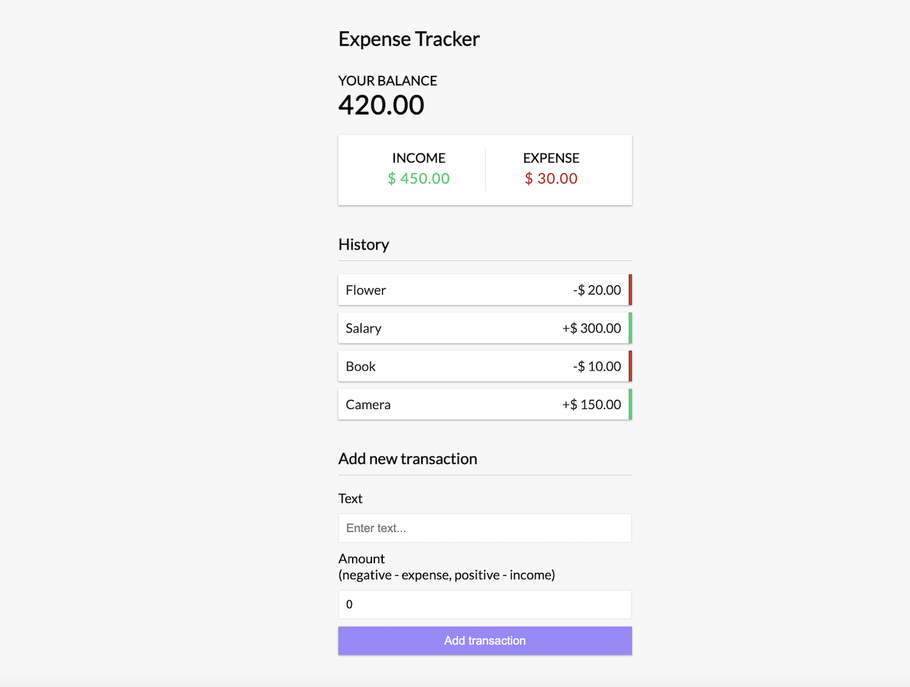

# Expense-Tracker
# Expense Tracker

Expense Tracker is a React web application that helps users manage their income and expenses. It provides a clear overview of financial transactions, including income and expenses, and allows users to add new transactions.

## Features

- Record income and expense transactions.
- View the balance, total income, and total expenses.
- Interactive display of transactions with categorized styling.

## Installation

1. **Clone the repository:**

   ```bash
   git clone https://github.com/yourusername/expense-tracker-react.git


cd expense-tracker-react

npm install

npm start


()
